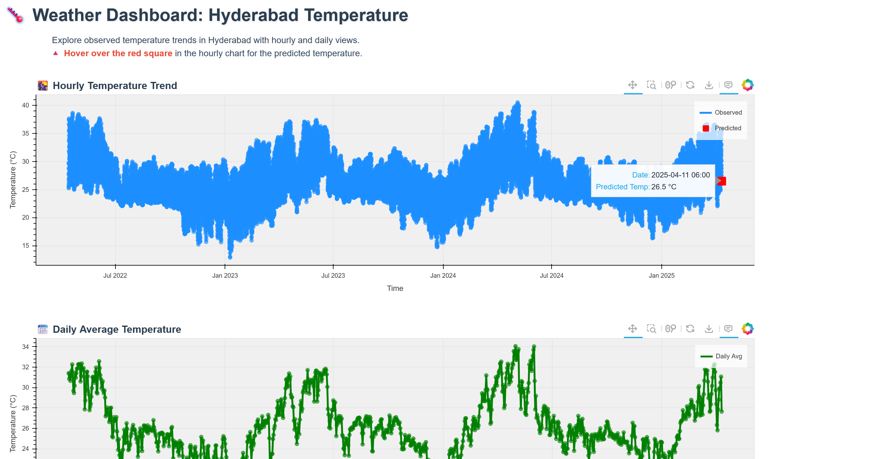

# 🌤️ Weather Forecasting in Hyderabad - Hackathon Project: Predict & Visualize Like a Pro

## Overview

The **Weather Forecasting Hackathon Project** is a cutting-edge solution for predicting temperature and weather conditions. It combines machine learning (XGBoost), real-time APIs (Open-Meteo), and an interactive Bokeh dashboard to deliver precise forecasts and stunning visualizations. Whether you're a data scientist, developer, or weather enthusiast, this project offers an innovative way to explore weather patterns.

---

### 🚀 Why This Project Shines

- **Accurate Predictions**: Leverages XGBoost for both temperature regression and weather condition classification.
- **Real-Time Data**: Fetches up-to-date weather insights via Open-Meteo and Visual Crossing APIs.
- **Interactive Visuals**: A live Bokeh dashboard that allows you to dynamically explore actual vs. predicted weather data.
- **Automated Model Retraining**: Cron jobs inside Docker containers ensure seamless model retraining on a regular schedule
---

## 📚 Notebook Overview

The `Weather_forecast.ipynb` notebook provides a detailed analysis of how predictions are made and evaluated. It includes:

- **Data Exploration**: Visualizing raw weather data and understanding the dataset.
- **Feature Engineering**: Implementing advanced features such as lag features, Fourier transforms, and cyclic encoding to improve prediction accuracy.
- **Model Training**: Training the XGBoost model for both temperature prediction (regression) and weather condition classification, including performance evaluation metrics like RMSE and F1-score.

Run the notebook in Jupyter or Google Colab for an interactive experience.


### 🎯 Features

For a more detailed analysis of how these features are implemented and evaluated, please check out the `Weather_forecast.ipynb` notebook.

- **Data Fetching**: Pulls historical and forecast data globally using trusted APIs (Open-Meteo & Visual Crossing).
- **Feature Engineering**: Implements advanced techniques such as lag features, rolling means, Fourier transforms, and cyclic encoding to improve prediction accuracy.
- **Machine Learning Pipeline**: Utilizes XGBoost for temperature prediction (regression) and weather condition classification.
- **Interactive Dashboard**: A Bokeh-powered dashboard visualizes weather predictions and provides insights into actual vs. predicted results.
- **Automation**: Dockerized cron jobs periodically retrain the model to ensure the forecast remains fresh and accurate.
- **Scalability**: The project is modular, making it easy to add new features or scale for larger datasets or more locations.

---

### 🛠️ Tech Stack

| **Component**        | **Technology**        |
|----------------------|-----------------------|
| **Machine Learning** | XGBoost, Scikit-learn |
| **Data Fetching**    | Open-Meteo API        |
| **Visualization**    | Bokeh                 |
| **Automation**       | Docker, Cron Jobs     |
| **Data Processing**  | Pandas, NumPy         |
| **Environment**      | Python, Colab         |

---

### 📂 Project Structure

```bash
weather-forecasting-hackathon/
├── model/                        # ML pipeline
│   ├── data_fetcher.py           # Fetches API data
│   ├── data_preprocessor.py      # Cleans and preprocesses data
│   ├── feature_engineering.py    # Creates advanced features
│   ├── model_retrain_automation.py # Automates model retraining
│   └── run_model_retrain.py      # Main retraining script
├── bokeh/                        # Visualization layer
│   ├── visualizer.py             # Bokeh dashboard script
│   └── weather_data_with_predictions.csv # Predicted data
├── src/                          # App entrypoint & data
│   ├── run.py                    # Scheduler for retraining
│   └── artifacts/weather_data.csv # Raw weather data
├── Weather_forecast.ipynb        # Detailed analysis notebook
├── requirements.txt              # Dependencies
├── Dockerfile                    # Docker configuration
└── README.md                     # Project documentation
```

---

## 🚀 Getting Started

### Prerequisites

- Python 3.8+
- Docker (for automation)
- Git

### Installation

1. **Clone the Repository**:
   ```bash
   git clone https://github.com/your-username/weather-forecasting-hackathon.git
   cd weather-forecasting-hackathon
   ```
2. **Set Up a Virtual Environment**:
   ```bash
   python -m venv .venv
   source .venv/bin/activate  # On Windows: .venv\Scripts\activate
   ```
3. **Install Dependencies**:
   ```bash
   pip install -r requirements.txt
   ```

# 🔁 Model Retraining & Real-Time Prediction

## Model Retraining Automation
The model is periodically retrained to adapt to evolving weather patterns.  
This is automated using a cron job that runs the `run_model_retrain.py` script on a defined schedule inside a Docker container.

## 🔍 Cron Job

- **Model Retraining Automation**: Cron jobs in Docker ensure that the model is retrained periodically, keeping predictions fresh as weather patterns evolve. Retraining is triggered through the `run_model_retrain.py` script and runs automatically according to the schedule.
- **Real-Time Prediction**: The model makes real-time predictions using weather data fetched from Open-Meteo and Visual Crossing APIs. The predictions are displayed in the Bokeh dashboard, allowing users to explore actual vs. predicted temperature and weather conditions in real-time.

**Example Cron Job Setup**:
```bash
0 0 * * * cd /path/to/project && python3 src/run.py
```

### 🐳 Run with Docker

Build and run the project inside a Docker container:
```bash
docker build -t weather-forecasting-app .
docker run -d --name weather_container weather-forecasting-app
```

### 📊 Run the Bokeh Dashboard

Experience real-time weather forecasts through an interactive dashboard powered by Bokeh.

To launch the dashboard locally:

```bash
cd bokeh
bokeh serve --show bokeh/visualizer.py
```


## 🙌 Acknowledgments

- Thanks to **Open-Meteo** and **Visual Crossing** for their fantastic APIs.
- Kudos to **Bokeh** for enabling stunning visualizations.
- Special thanks to **XGBoost** for powering our predictions.

⭐ If you enjoyed this project, give it a star on GitHub! Let's make weather forecasting epic together! 🌦️

